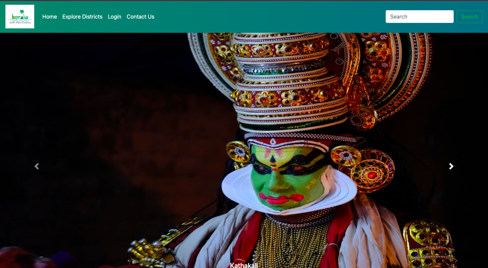

# Kerala Tourism Website

This was an academic assignment for ICTAK. The Kerala Tourism website allows users to explore 14 districts in Kerala, and the user can find the 3 most famous spots in each district. 

---
## Project Details: 
- Form  validation for the login and sign-up page is done using JavaScript (eg: email, phone and password validation)
- Password image strength meter is also implemented

> The project can be accessed at: https://arathi-ram.github.io/Kerala_Tourism_Website/

